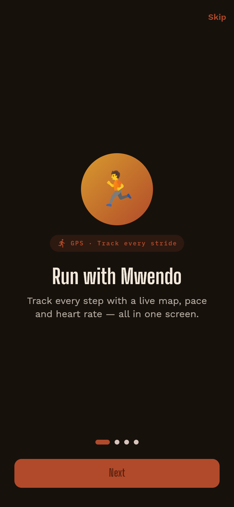
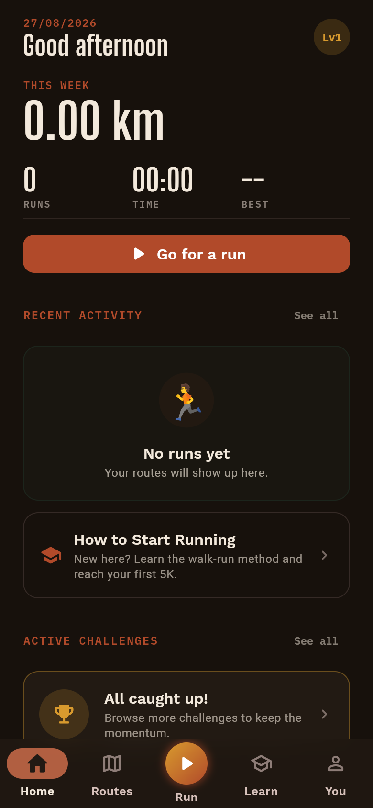
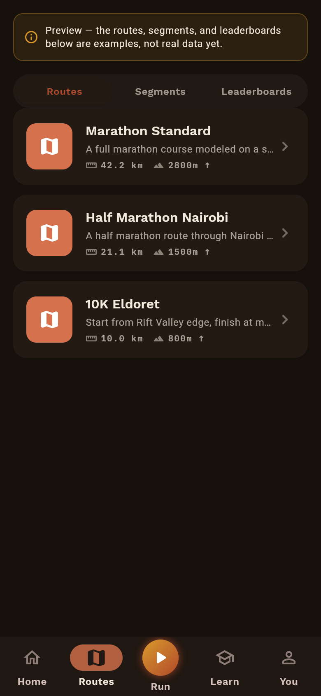
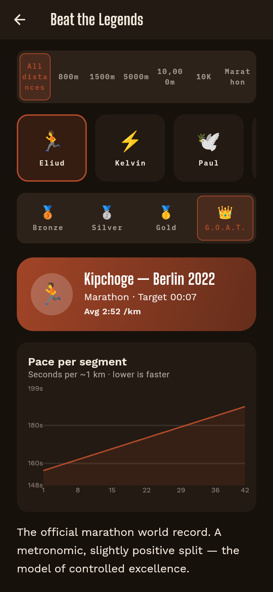
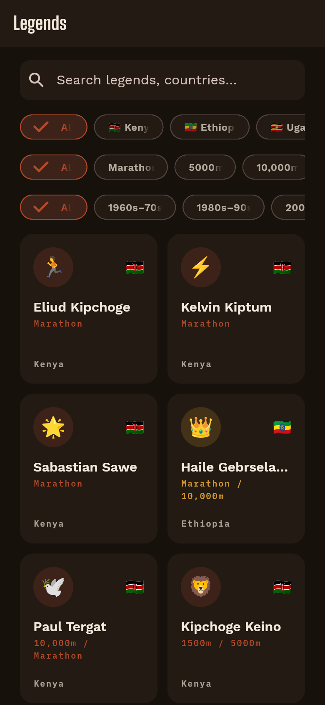
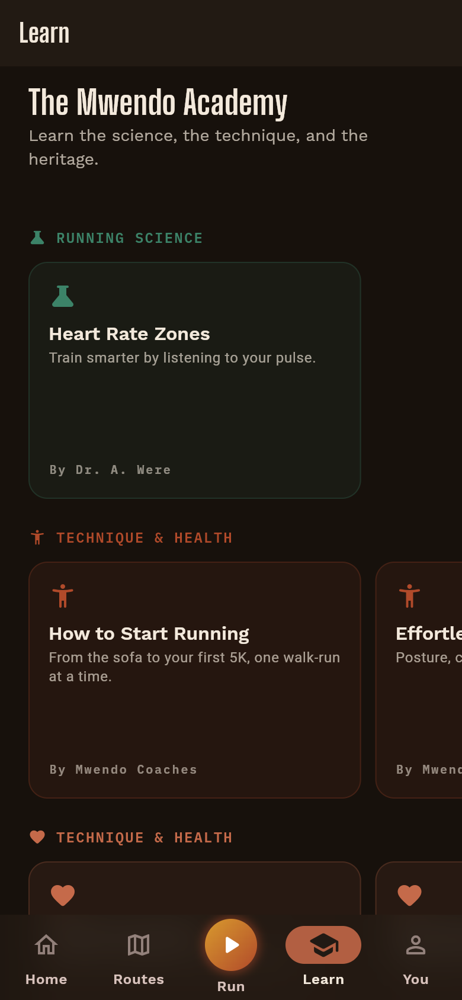
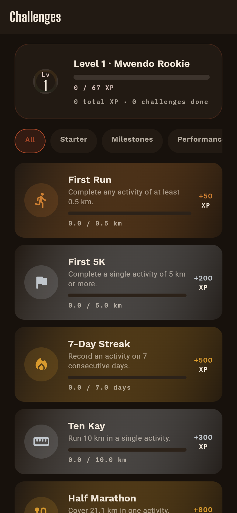
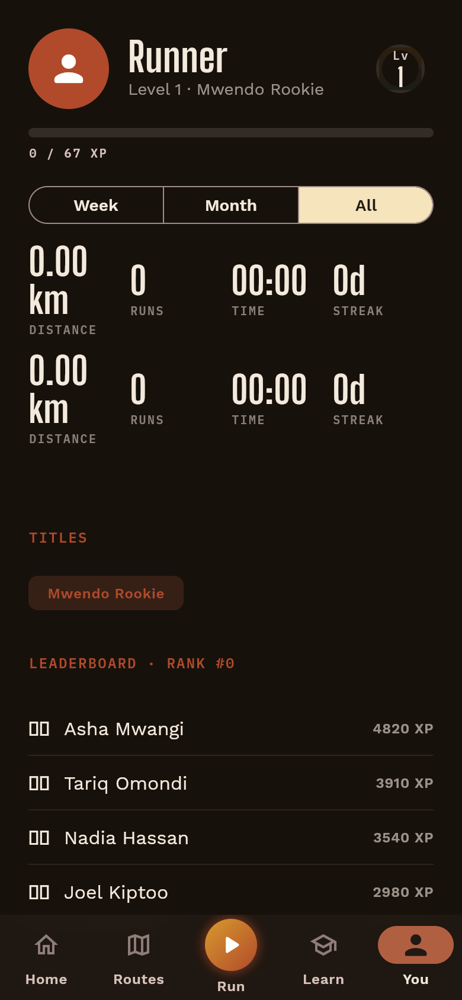

<div align="center">


# Mwendo

### *Swahili for speed, motion, movement.*

**A GPS running tracker that teaches you the craft of running and lets you race the greatest distance runners East Africa has ever produced — Kipchoge's splits, Kiptum's pace, all on your own two feet.**

[](https://github.com/Michael-Mathu/M-Run-2.0/actions/workflows/test.yml)
[](https://flutter.dev)
[](https://dart.dev)
[](https://golang.org)
[](https://postgis.net)
[](https://redis.io)
[](LICENSE-APACHE)

</div>

---

## What is Mwendo?

Most running apps are a black box: a green squiggle on a map and a pace number, with no idea whether either is accurate. Mwendo is built the other way around — it's **offline-first, transparent about GPS quality, and doesn't send your run anywhere it doesn't have to.** A multi-stage GPS pipeline (Kalman filtering, outlier rejection, stationary-drift suppression) turns raw, jittery satellite fixes into a clean, trustworthy track instead of a jagged mess.

On top of that honest core, Mwendo adds the two things that make it more than a tracker:

- **🏃 Beat the Legends** — race in real time against pacing models of real world-record holders (Kipchoge, Kiptum, Kipyegon, Bekele, and more), scaled to Bronze / Silver / Gold / G.O.A.T. difficulty tiers.
- **🎓 The Mwendo Academy** — bite-sized lessons on running science, technique, and East African distance-running heritage, so the app teaches you something between runs, not just after them.

---

## A look inside

<table>
<tr>
<td align="center" width="25%"><br/><sub><b>Welcome</b></sub></td>
<td align="center" width="25%"><br/><sub><b>Home dashboard</b></sub></td>
<td align="center" width="25%"><br/><sub><b>Explore routes</b></sub></td>
<td align="center" width="25%"><br/><sub><b>Beat the Legends</b></sub></td>
</tr>
<tr>
<td align="center"><br/><sub><b>Legends roster</b></sub></td>
<td align="center"><br/><sub><b>Mwendo Academy</b></sub></td>
<td align="center"><br/><sub><b>Challenges & XP</b></sub></td>
<td align="center"><br/><sub><b>Your profile</b></sub></td>
</tr>
</table>

---

## Key capabilities

* 🛰️ **Deterministic multi-stage GPS pipeline** — outlier lookahead, 2D ENU Extended Kalman filtering, dead-reckoned gap bridging, and density-weighted stationary clustering, so a route looks like the road you ran, not a jagged approximation of it.
* 🏃 **"Beat the Legends" pacing engine** — race in real time against mathematical models of world-record holders, scaled across Bronze, Silver, Gold, and G.O.A.T. tiers.
* 🛡️ **Zero-loss crash recovery** — local SQLite storage via Drift, backed by native C SQLite binaries, plus a durable session-draft journal so a killed app or dead battery never costs you a run.
* 🗺️ **High-performance vector maps** — a local MapLibre GL dark Carto basemap with ghost overlays, auto-follow camera, and live pace polylines.
* ☁️ **High-throughput geospatial cloud API** — a Go 1.22 backend with PostGIS linestrings, Douglas-Peucker route simplification (`ST_Simplify`), and Redis sorted-set leaderboards with a graceful in-memory fallback.
* 🌐 **Bilingual English & Swahili UI** — full localization across the curriculum, legends history, and real-time audio/haptic cues.

---

## Architecture

```
M-Run-2.0/
├── app/                        # Main Flutter Client Application
│   ├── lib/
│   │   ├── core/               # Gamification, l10n, theme, permissions, safety
│   │   ├── data/               # Drift SQLite database, models, repositories, GPX
│   │   ├── design_system/      # Atomic UI components, cards, banners, HUDs
│   │   ├── features/           # Feature slices: tracking, beat, learn, explore, etc.
│   │   └── widgets/            # MapLibre map wrappers, metrics tiles, overlays
│   └── test/                   # Widget and repository integration tests
├── packages/
│   ├── gps_pipeline/           # Pure Dart GPS filter, Kalman math, quality analysis
│   ├── mwendo_gps_engine/      # Federated platform plugin (Android Foreground / iOS)
│   └── mwendo_fit_parser/      # Rust FFI bridge for binary Garmin FIT file parsing
├── backend/                    # Go Cloud Service (PostGIS + Redis + JWT Auth)
│   ├── cmd/api/                # HTTP server bootstrap and routing
│   └── internal/               # Activity, Auth, DB, Config, and Leaderboard domains
├── docker-compose.yml          # PostGIS 16 + Redis 7 + Go API orchestration
└── Makefile                    # Unified build, test, and execution tasks
```

For in-depth architectural details, see the [Architecture Documentation](docs/ARCHITECTURE.md).

---

## Quick start

### Prerequisites
* **Flutter SDK**: `^3.22.0` (Dart `^3.12.2`)
* **Go SDK**: `^1.22.0`
* **Docker & Docker Compose**
* **Rust & Cargo** (for the native FIT parser FFI)

### 1. Install dependencies
```bash
make setup-app
```

### 2. Start backend services (PostGIS & Redis)
```bash
docker compose up -d
```

### 3. Run the Flutter app
```bash
make run-app
```

### 4. Run tests & static analysis
```bash
make analyze
make test-all
```

---

## Documentation index

Exhaustive technical documentation is organized in the [`docs/`](docs/) directory:

| Document | Description |
| :--- | :--- |
| 📖 **[Master Technical Documentation](docs/TECHNICAL_DOCUMENTATION.md)** | Definitive source of truth covering all system domains and specifications |
| 🏛️ **[Architecture & Design](docs/ARCHITECTURE.md)** | Architectural patterns, GPS state-space Kalman filtering, data flow models |
| 🔌 **[API & Module Reference](docs/API_REFERENCE.md)** | Granular interface reference for Dart packages, Drift schema, and REST API |
| 🛠️ **[Installation & Deployment](docs/SETUP_AND_DEPLOYMENT.md)** | Step-by-step setup, Docker provisioning, and CI/CD pipelines |
| 🧭 **[Usage Guides & Tutorials](docs/USAGE_GUIDES.md)** | Practical walkthroughs for tracking, ghost racing, and quality diagnostics |
| 🎨 **[Design System](docs/DESIGN_SYSTEM.md)** | Color palettes, typography, glassmorphism tokens, and UI components |
| 🤝 **[Contribution Guidelines](docs/CONTRIBUTING.md)** | Coding standards, linting rules, testing protocol, and Git lifecycle |

---

## License

Mwendo is dual-licensed under the [Apache License 2.0](LICENSE-APACHE) and the [MIT License](LICENSE-MIT).
